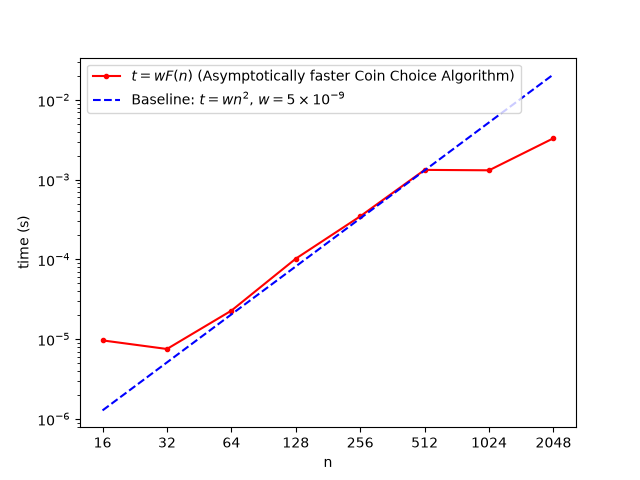

# Homework 1
## 1. Runtime Analysis
(a) $w = 5 \times 10^{-9}$ 

(b)
```pseudocode
assert a,b,c,n > 0 
assert a,b,c <= n // set bounds that a,b,c are at most n

// get the maximum numbers of each bill for the permutation
max 3 buck <- min(c,n/3)
max 2 buck <- min(b,n/2)
max 1 buck <- min(a,n)

// initialize the counter
count <- 0

for (the number of max 3 buck):
    for (the number of max 2 buck):
        if (1. (3* the number of 3 buck for each iteration) > n
            2. (2* the number of 2 buck for each iteration) > n
            3. (n - (
                    (3* the number of 3 buck for each iteration)
                    +
                    (2* the number of 2 buck for each iteration)
                    ) > n
                )
            ):
            do nothing and move on
        else:
            add 1 to count

return count         
```
Proof:
Let `a` and `b` be the number of 3-buck and 2-buck coins to be combined.
Let `A` be a 2D array that contains all sums of permutations of `a` AND `b` that those sums are always less than or equal to `n`.
So, the number of possible permutations is $a \times b$ and the runtime is $O(n^2)$.
If we add another condition that filters whether the value of each sum in `A` subtracted by `n` does not exceed the maximum number of 1-buck coin provided, we can calculate all the possible permutation and how many the permutations there are at the same time in $n^2$ times.

Hence, the asymptotic coin choice algorithm can have time complexity of $O(n^2)$.

Runtime Analysis:
1. Variable initialization: the maximum number of coins we can combine and counter $O(1)$
```Java
int max_three_buck = Math.min(c, n/3);
int max_two_buck = Math.min(b,n/2);
int max_one_buck = Math.min(a,n);
int count = 0;
```

2. Main Loop: $O(n^2)$
1) iterate through the maximum numbers of three-buck and two-buck coin (O(n^2))
2) eliminate the possible permutations that would go out of bounds from the counter
    2-1. if the given number of 3-buck coins worth more than n
    2-2. if the given number of 2-buck coins worth more than n
    2-3. if the given number of 3-AND-2-buck coins(permutation) worth more than n
    2-4. From the permutation without 2-1,2,3., if the left-over money is greater than the maximum number of 1-buck coin.
    2-5. Otherwise, put it in the counter.
3) Return the number of permutations (O(1)) 
```Java
for (int first = max_three_buck; first >= 0; first--){
    for (int second = max_two_buck; second >= 0; second--){
        if(3*first > n||2 * second > n || (3*first)+(2*second) > n || (n-(2*second+3*first)) > max_one_buck){
            continue;
        } else {
            count++;
        }
    }
}
```
3. Return result: $O(1)$
```Java
return count;
```

Complete Runtime = $O(1)$ + $O(n^2)$ + $O(1)$ = $O(n^2)$
Therefore, the runtime of this asymptotically faster algorithm for this problem is $O(n^2)$.
(c)

Initially, `w` value was $5 \times 10^{-8}$ as default. For part (a), I changed the exponent to $-9$, which fits to the original algorithm with time complexity of $O(n^3)$. For the part (c), I did not change `w` value and still able to fit my asymptotically faster algorithm with time complexity of $O(n^2)$. Because `w` value is just an adjustment parameter to make the comparison between the baseline $t=wn^2$ and my algorithm human-friendly and my hardware setup was not changed, I did not have to change `w` value from part (a). One problem I encountered was the data extraction. Since I wrote the algorithm in Java and the original algorithm is in python, I had to come up with an idea that I can put into the plot in python (I don't know how to plot in Java so I had to extract data that can be read cross-linguistically.)

## 2. Running Sum
### Context
- Given arrays $A$ and $B$ ($B$ with $n$ elements), 
$$\begin{aligned}
A[i] = B[i] + B[i+1] + B[i+2] + ... + B[i+r-1]\\
\text{for all } i : 0 ≤ i ≤ n-r
\end{aligned}
$$
- 0-based indexing; $i+r-1$ for upper bound.
(a) The length of array $A$ is $n - r+1$. Because if the bound for $i$ is $0≤i≤n-r$, since it is inclusive and 0-based indexing, we need to add 1 to get the final array length and not loosing the last element of the array $A$.
(b)
1st box: `0`
2nd box: `A.length`
3rd box: `i`
4th box: `i+r`
5th box: `A[i] + B[j]`
(c)
1st box: `1`
2nd box: `A.length`
3rd box: `A[i-1] - B[i-1] + B[i+r-1]`

(d)
Proof by Induction
Prove $A_i = \Sigma_{k=i}^{i+r-1} B_k$
1. Base case: $i=0, r=1$
$$
\begin{array}{ll}
A_0 = \Sigma_{k=0}^{0+1}B_k = \Sigma_{k=0}^{1}B_k = B_0+B_1\\\\
\text{it holds!}
\end{array}
$$

2. Inductive Hypothesis: <br>
If $A_i=\Sigma_{k=i}^{i+r-1}B_k$ holds, then $A_i=\Sigma_{k=i}^{i+r-1}B_{k+1}$ holds.

$$\begin{array}{ll}
A_i = B_i + B_{i+1} + ... + B_{i+r}\\
A_{i+1} = B_{i+1} + B_{i+2} + ... + B_{i+r}\\
A_{i+1}-A_i = -B_i + B_{i+r}\\
A_{i+1} = A_i-B_i+B_{i+r}
\end{array}
$$
The algorithm has a `for` loop of `O(n)` time complexity that has the same equation as $A_{i+1}$. □

